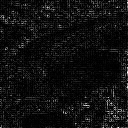
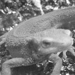
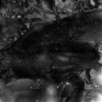

# Q. 71 - 80

## Q.71. 掩膜（Masking）

使用`HSV`对`imori.jpg`进行掩膜处理，只让蓝色的地方变黑。

像这样通过使用黑白二值图像将对应于黑色部分的原始图像的像素改变为黑色的操作被称为掩膜。

要提取蓝色部分，请先创建这样的二进制图像，使得`HSV`色彩空间中180<=H<=260的位置的像素值设为1，并将其0和1反转之后与原始图像相乘。

这使得可以在某种程度上将蝾螈（从背景上）分离出来。

| 输入 (imori.jpg) | マスク(answers/answer_70.png) | 输出(answers/answer_71.jpg) |
| :--------------: | :---------------------------: | :-------------------------: |
|    |     |   |

答案 >> [answers/answer_71.py](https://github.com/yoyoyo-yo/Gasyori100knock/blob/master/Question_71_80/answers/answer_71.py)

## Q.72. 掩膜（色彩追踪（Color Tracking）+形态学处理）

在问题71中掩膜并不是十分精细，蝾螈的眼睛被去掉，背景也有些许残留。

因此，可以通过对掩膜图像应用`N = 5`闭运算（问题50）和开运算（问题49），以使掩膜图像准确。

| 输入 (imori.jpg) | マスク(answers/answer_72_mask.png) | 输出(answers/answer_72.jpg) |
| :--------------: | :--------------------------------: | :-------------------------: |
|    |     |   |

答案 >> [answers/answer_72.py](https://github.com/yoyoyo-yo/Gasyori100knock/blob/master/Question_71_80/answers/answer_72.py)

## Q.73. 缩小和放大

将`imori.jpg`进行灰度化处理之后，先缩小至原来的0.5倍，再放大两倍吧。这样做的话，会得到模糊的图像。

放大缩小的时候使用双线性插值。如果将双线性插值方法编写成函数的话，编程会变得简洁一些。

| 输入 (imori.jpg) | 输出(answers/answer_73.jpg) |
| :--------------: | :-------------------------: |
|    |   |

答案 >> [answers/answer_73.py](https://github.com/yoyoyo-yo/Gasyori100knock/blob/master/Question_71_80/answers/answer_73.py)

## Q.74. 使用差分金字塔提取高频成分

求出问题73中得到的图像与原图像的差，并将其正规化至[0,255]​范围。

ここで求めた图像はエッジとなっている。つまり、图像中の高周波成分をとったことになる。

| 输入 (imori.jpg) | 输出(answers/answer_74.jpg) |
| :--------------: | :-------------------------: |
|    |   |

答案 >> [answers/answer_74.py](https://github.com/yoyoyo-yo/Gasyori100knock/blob/master/Question_71_80/answers/answer_74.py)

## Q.75. 高斯金字塔（Gaussian Pyramid）

在这里我们求出原图像1/2, 1/4, 1/8, 1/16, 1/32大小的图像。

像这样把原图像缩小之后（像金字塔一样）重叠起来的就被称为高斯金字塔。

这种高斯金字塔的方法现在仍然有效。高斯金字塔的方法也用于提高图像清晰度的超分辨率成像（Super-Resolution ）深度学习方法。

| 输入 (imori.jpg) | 1/1(answers/answer_75_1.jpg) |             1/2              |             1/4              |             1/8              |             1/16              |             1/32              |
| :--------------: | :--------------------------: | :--------------------------: | :--------------------------: | :--------------------------: | :---------------------------: | :---------------------------: |
|    |  |  |  |  |  |  |

答案 >> [answers/answer_75.py](https://github.com/yoyoyo-yo/Gasyori100knock/blob/master/Question_71_80/answers/answer_75.py)

## Q.76. 显著图（Saliency Map）

在这里我们使用高斯金字塔制作简单的显著图。

显著图是将一副图像中容易吸引人的眼睛注意的部分（突出）表现的图像。

虽然现在通常使用深度学习的方法计算显著图，但是一开始人们用图像的`RGB`成分或者`HSV`成分创建高斯金字塔，并通过求差来得到显著图（例如[Itti等人的方法](http://ilab.usc.edu/publications/doc/IttiKoch00vr.pdf)）。

在这里我们使用在问题75中得到的高斯金字塔来简单地求出显著图。算法如下：

1. 我们使用双线性插值调整图像大小至1/128, 1/64, 1/32, ……，一开始是缩放至1/128。
2. 将得到的金字塔（我们将金字塔的各层分别编号为0,1,2,3,4,5）两两求差。
3. 将第2步中求得的差分全部相加，并正规化至[0,255]。

完成以上步骤就可以得到显著图了。虽然第2步中并没有指定要选择哪两张图像，但如果选择两个好的图像，则可以像答案那样得到一张显著图。

从图上可以清楚地看出，蝾螈的眼睛部分和颜色与周围不太一样的地方变成了白色，这些都是人的眼睛容易停留的地方。

解答例( (0,1), (0,3), (0,5), (1,4), (2,3), (3,5) を使用)

| 输入 (imori.jpg) | 输出(answers/answer_76.jpg) |
| :--------------: | :-------------------------: |
|    |   |

答案 >> [answers/answer_76.py](https://github.com/yoyoyo-yo/Gasyori100knock/blob/master/Question_71_80/answers/answer_76.py)


## Q.77. Gabor 滤波器（Gabor Filter）

来进行Gabor 滤波吧。

Gabor 滤波器是一种结合了高斯分布和频率变换的滤波器，用于在图像的特定方向提取边缘。

滤波器由以下式子定义：

```bash
G(y, x) = exp(-(x'^2 + g^2 y'^2) / 2 s^2) * cos(2 pi x' / l + p)
x' = cosA * x + sinA * y
y' = -sinA * x + cosA * y

y, x 滤波器的位置　滤波器的大小如果为K的话、 y, x 取 [-K//2, k//2]。
g ... gamma Gabor 滤波器的椭圆度
s ... sigma 高斯分布的标准差
l ... lambda 余弦函数的波长参数
p ... 余弦函数的相位参数
A ... Gabor 滤波核中平行条带的方向
```

在这里，取K=111, s=10, g = 1.2, l =10, p=0, A=0，可视化 Gabor 滤波器吧！

实际使用 Gabor 滤波器时，通过归一化以使滤波器值的绝对值之和为1​使其更易于使用。

在答案中，滤波器值被归一化至[0,255]以进行可视化。

|输出(answers/answer_77.jpg)|
|:---:|
||

答案 >> [answers/answer_77.py](https://github.com/yoyoyo-yo/Gasyori100knock/blob/master/Question_71_80/answers/answer_77.py)

## Q.78. 旋转 Gabor 滤波器

在这里分别取 A=0, 45, 90, 135来求得旋转 Gabor 滤波器。其它参数和问题77一样，K=111, s=10, g = 1.2, l =10, p=0。

Gabor 滤波器可以通过这里的方法简单实现。

|输出(answers/answer_78.png)|
|:---:|
||

答案 >> [answers/answer_78.py](https://github.com/yoyoyo-yo/Gasyori100knock/blob/master/Question_71_80/answers/answer_78.py)

## Q.79. 使用 Gabor 滤波器进行边缘检测

将`imori.jpg`灰度化之后，分别使用A=0, 45, 90, 135的 Gabor 滤波器进行滤波。其它参数取为：K=11, s=1.5, g=1.2, l=3, p=0。

如在答案示例看到的那样， Gabor滤波器提取了指定的方向上的边缘。因此，Gabor 滤波器在边缘特征提取方面非常出色。

一般认为 Gabor 滤波器接近生物大脑视皮层中的初级简单细胞（V1 区）。也就是说，当生物看见眼前的图像时也进行了特征提取。つまり生物が見ている時の眼の前の图像の特徴抽出を再現しているともいわれる。

一般认为深度学习的卷积层接近 Gabor 滤波器的功能。然而，在深度学习中，滤波器的系数通过机器学习自动确定。作为机器学习的结果，据说将发生类似于 Gabor 滤波器的过程。

| 输入 (imori.jpg) | 输出(answers/answer_79.png) |
| :--------------: | :-------------------------: |
|    |   |

答案 >> [answers/answer_79.py](https://github.com/yoyoyo-yo/Gasyori100knock/blob/master/Question_71_80/answers/answer_79.py)

## Q.80. 使用 Gabor 滤波器进行特征提取

通过将问题79中得到的4张图像加在一起，提取图像的特征。

观察得到的结果，图像的轮廓部分是白色的，获得了类似于边缘检测的输出。

深度学习中的卷积神经网络，最初已经具有提取图像的特征的功能，在不断重复特征提取的计算过程中，自动提取图像的特征。

| 输入 (imori.jpg) | 输出(answers/answer_80.jpg) |
| :--------------: | :-------------------------: |
|    |   |

答案 >> [answers/answer_80.py](https://github.com/yoyoyo-yo/Gasyori100knock/blob/master/Question_71_80/answers/answer_80.py)
